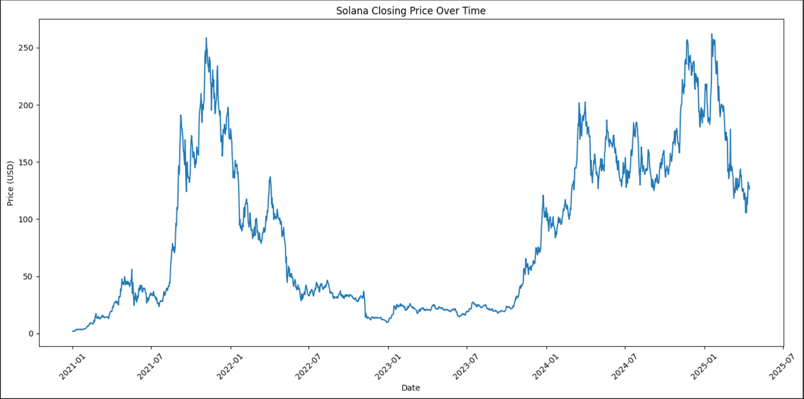
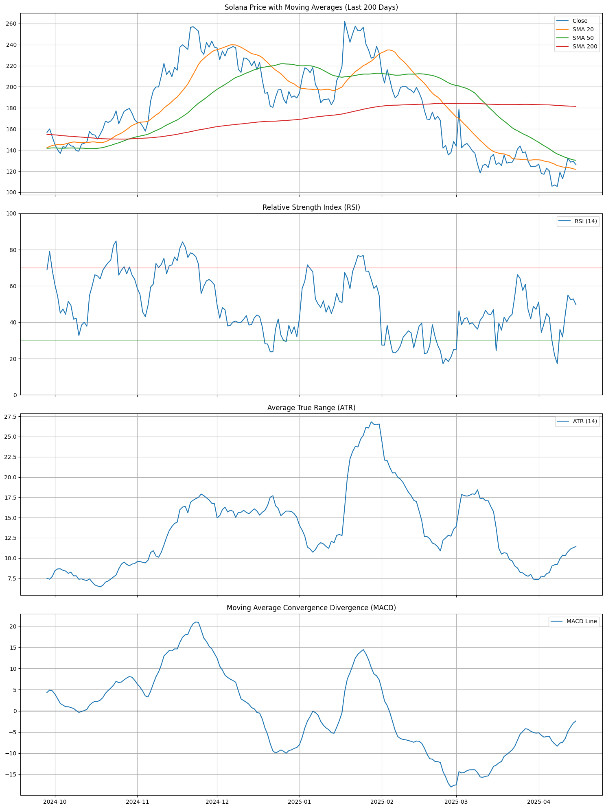
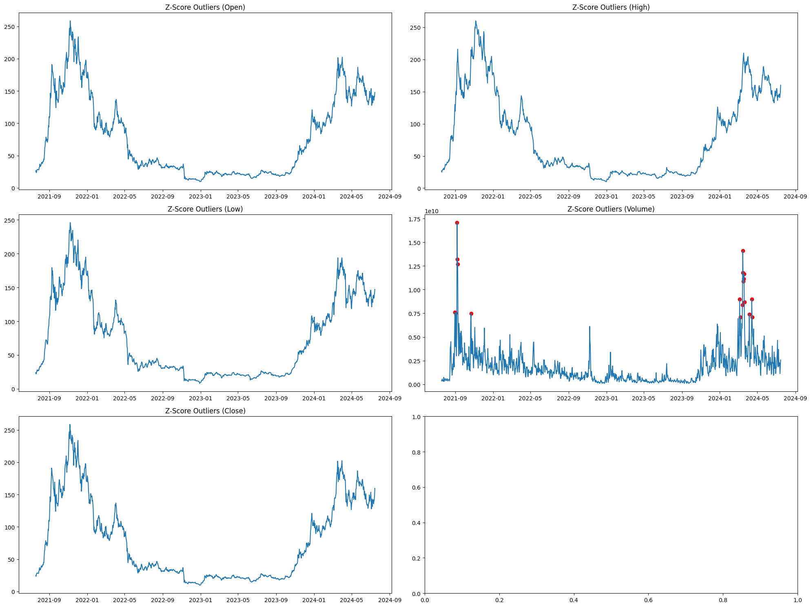
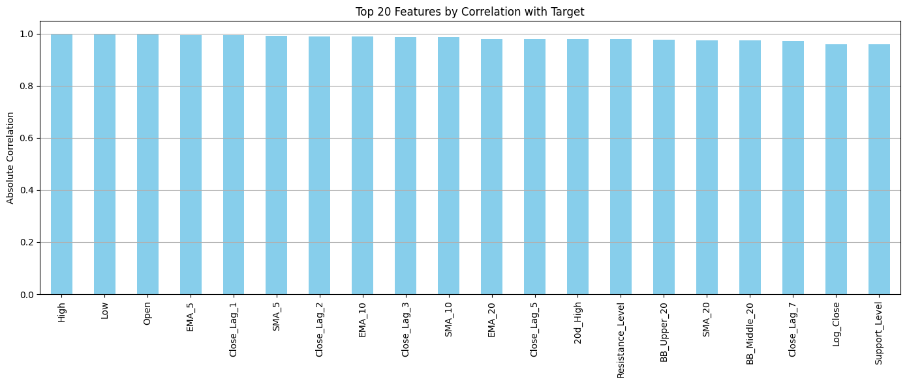
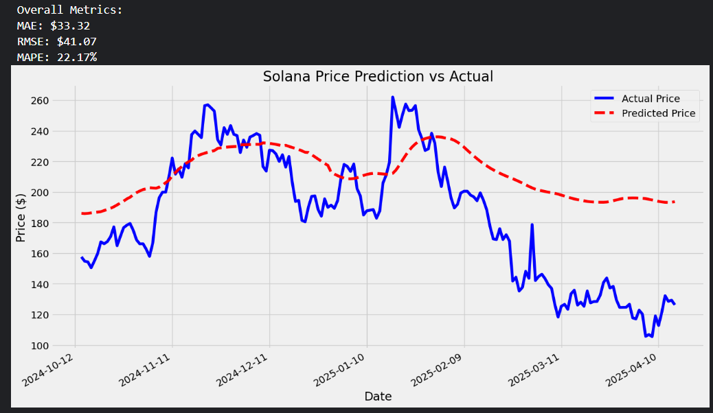
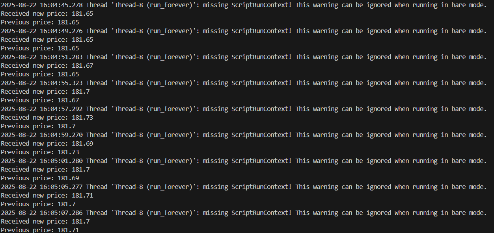
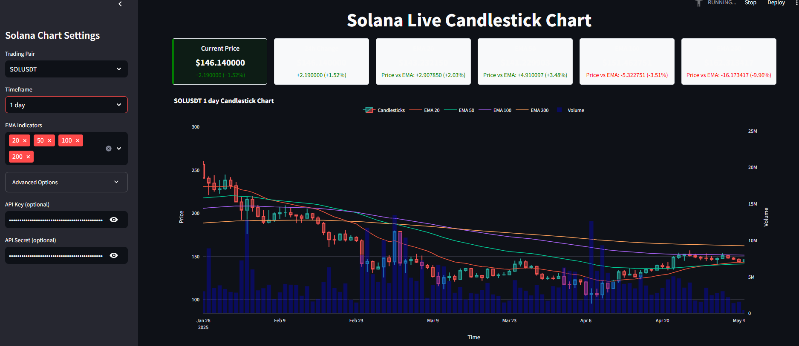

# Solana Price Data Analysis

End-to-end analysis of Solana (SOL) price data in OHLCV format, covering **01-01-2021 to 29-09-2024**: technical-indicator generation, data cleaning and feature engineering, exploratory analysis, price prediction, and a live price dashboard.

## Repository structure

```
├── notebooks/
│   ├── 01-technical-indicators.ipynb     # Fetch OHLCV data, add indicators (ta library)
│   ├── 02-data-processing-pipeline.ipynb # Full pipeline: cleaning, feature engineering,
│   │                                     # outlier treatment, scaling, feature selection
│   ├── 03-eda-and-modeling.ipynb         # Exploratory analysis + baseline model training/eval
│   └── 04-price-prediction-tft.ipynb     # Time-series price prediction with a Temporal
│                                         # Fusion Transformer (built for Google Colab)
├── app/
│   └── live_dashboard.py                 # Streamlit dashboard, live SOL price via Binance
├── data/
│   ├── raw/                               # Original fetched OHLCV data
│   └── processed/                         # Intermediate + final outputs of notebook 02
├── models/                                # Saved scalers (joblib/pickle) used by the pipeline
├── images/                                # Charts and screenshots used below
├── requirements.txt                       # Dependencies to run the dashboard
└── requirements-notebooks.txt             # Dependencies to run notebooks 01–03
```

## Notebooks

| Notebook | Purpose |
|---|---|
| `01-technical-indicators.ipynb` | Fetches raw OHLCV data and adds technical indicators using the [`ta`](https://github.com/bukosabino/ta) library. |
| `02-data-processing-pipeline.ipynb` | Full pipeline: data loading, cleaning, feature engineering, train/valid split, outlier treatment (Z-score), feature scaling, and feature selection. Writes each stage's output to `data/processed/`. |
| `03-eda-and-modeling.ipynb` | Exploratory data analysis and visualization, followed by baseline model training, evaluation, and optimization. |
| `04-price-prediction-tft.ipynb` | Trains a Temporal Fusion Transformer (PyTorch Forecasting) for multi-step price prediction. Built and run on **Google Colab** — needs `torch`, `pytorch-lightning`, and `pytorch-forecasting`, which aren't in `requirements-notebooks.txt` since they're only needed for this notebook. |

## Live dashboard

`app/live_dashboard.py` is a Streamlit dashboard that streams live SOL price data straight from Binance's public REST and WebSocket endpoints — no API key needed.

### Run it locally

```bash
git clone https://github.com/<your-username>/solana-data-analysis.git
cd solana-data-analysis
pip install -r requirements.txt
streamlit run app/live_dashboard.py
```

## Reproducing the analysis notebooks

```bash
pip install -r requirements-notebooks.txt
jupyter notebook notebooks/
```

(`04-price-prediction-tft.ipynb` is Colab-only — see the table above.)

## Screenshots

| | |
|---|---|
| **Solana price chart** |  |
| **Key feature visualisation** |  |
| **Z-score outlier detection** |  |
| **Feature importance** |  |
| **Prediction vs. actual** |  |
| **Pipeline terminal output** |  |
| **Live dashboard** |  |

## License

Released under the [MIT License](./LICENSE).
